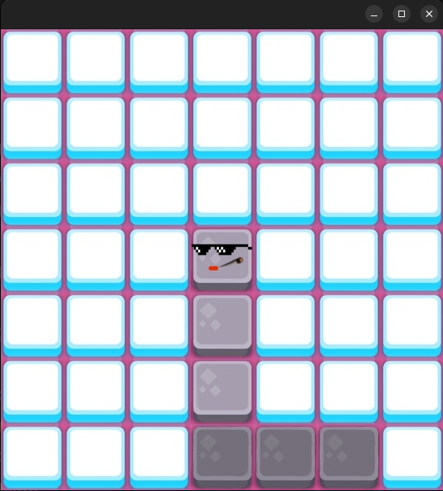
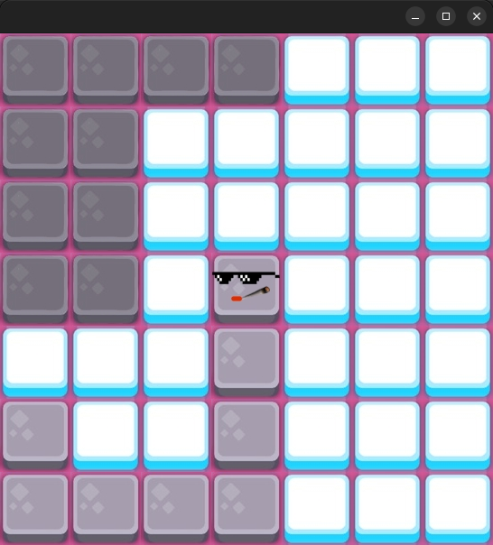
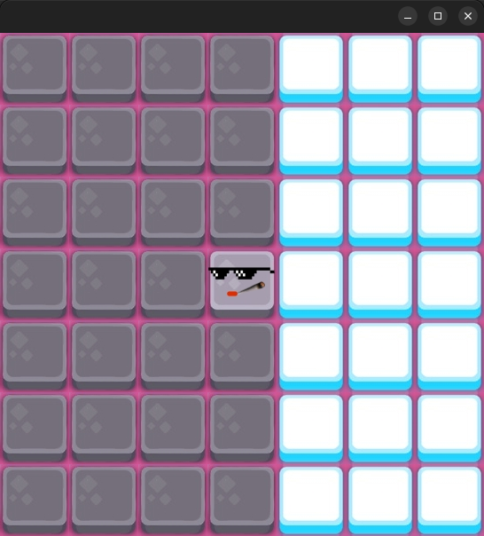
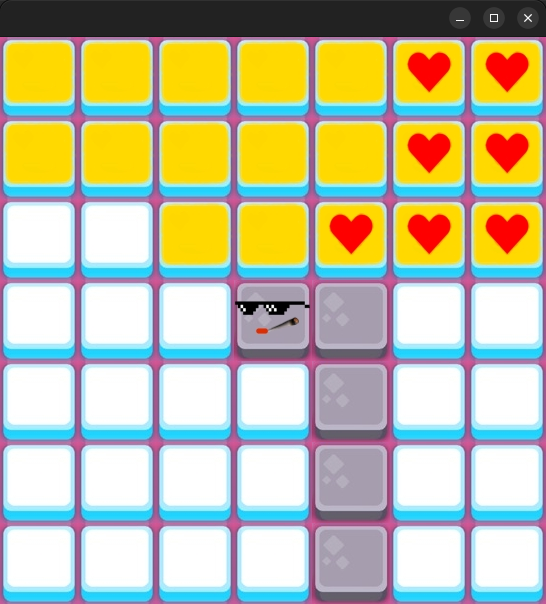

# **PAINT.IO**!

Hi! I implemented a mini version of this popular game in Java using Swing!

Choose your favorite player and let's start!



### This is the map!

-You can move in the field by using these keys:

  **```Up``` arrow key for ↑**
  
  **```Down``` arrow key for ↓**
  
  **```Left``` arrow key for ←**
  
  **```Right``` arrow key for →**

## The Rules:

**1-** If you come back to your house,
the houses surrended by your path, WILL BECOME YOURS!!!

For example:



can become:



**2-** Cross the path of enemy to ELIMINATE IT!

For example:



By the way, this is a mini version that implements only the basics of the game!
